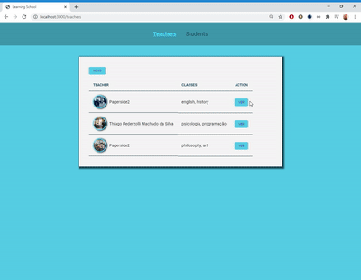

<h1 align="center">
    
</h1>

<h1 align="center">
⚔ Challenge nº 4
</h1>

# Indice

- [About](#-About)
- [Challenge Steps](#-Challenge-Steps)
- [Technologies](#-Technologies)

---
## Sobre:

- The **Learning School** was a result of challenge 4 in LaunchBase. It is part of the module **Gym Control** and the objective is build a system to manage private classes.

## Challenge Steps:

        - First we had to make the header;
        - Then we had to create a card to show the teachers information;
        - After that we had to create a form where the user is capable of register new teachers;
        - With this informations in ours Back-end, we had to import this data to ours Front;
        - Then, thinking that in the create process the user could type some wrong information, we had to create an edit page so them can be able to put the right information;
        - We had to offer to the user the possibility of delete some teacher register;
        - To make the access easier we create a table with some teachers information and a button to see each profile individualy;
        - With all this done, we had to create all the same for the students. But we changed some informations requested in the registration and different informations are showed in the table for students that in the table for teachers;
        - To be possible do all of that, was necessary work with Front-end and Back-end. We make code reuse to improve our application, creating one archive that can be used for many purposes with template engine.

## Technologies:

For create this system was used:

- 🚀HTML
- 🚀CSS
- 🚀JavaScript
- 🚀Node.js
- 🚀Nodemon
- 🚀Express
- 🚀Nunjucks
- 🚀JSON
- 🚀Browser Sync
- 🚀Method Override
- 🚀Npm Run All

---

<h1 align="center">
 
</h1>

Developed by © Thiago Pederzolli Machado da Silva